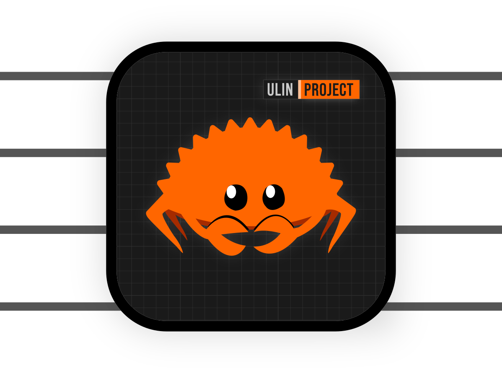
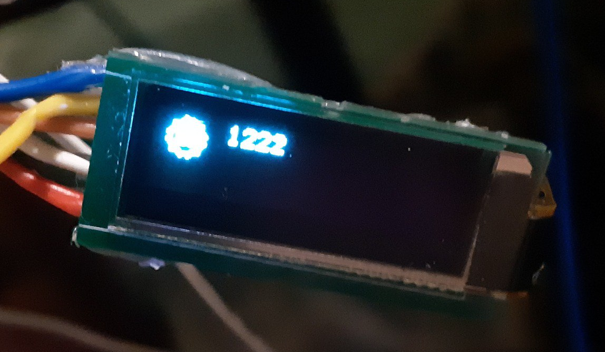

<div id="header" align="center">
  
  
  <b>[rusty_attiny13a]</b>
  
  (A weekend experiment using the Rust programming language on small attiny13a microcontrollers.)
  </br></br>
<div id="badges">
  <a href="./LICENSE-MIT">
    
  </a>
  <a href="./LICENSE-APACHE">
    
  </a>
  <a href="https://github.com/denisandroid">
    
  </a>
</div>
</div>

## Description:

Our package provides a minimal but functional SDK for use on ultra-small microcontrollers such as the ATTiny13A. The package implements a variety of software buses, including UART and I2C, which provides the ability to connect and interact with various peripheral devices. The library also includes experimental ultra-lightweight support for output to SSD1306.

## Project Goal:

The aim of our experimental project is to showcase the use of the Rust programming language on ultra-small microcontrollers like ATTiny13A. We aim to demonstrate that even on such constrained devices, Rust can be an effective and flexible development tool.

## Specifications:

| name | value |
| ---- | ----- |
| mcu | attiny13a |
| cpu | <b>9.6Mhz (internal, +osccal(pre-recorded in eeprom))</b> |
| mem | <b>64bytes</b> |
| flash | <b>1kb</b> |
| eeprom | <b>64bytes</b> |
| pio | <b>PB0-TX, PB1-RX, PB4-SDA, PB3-SCL</b> |

### UART:

1. Supports I/O at a specified speed using a parity bit (write-only bit).

3. Delays are implemented only in software (the timer is not used).

4. Supports recording to multiple I/O ports simultaneously.

5. Support for burst or single-byte reads.

examples: `uart`, `uart_rw`, `uart_rw_debug`, `uart_rw_onebyte`

env: 
| env_name    | def_env_value | possible_env_value | description |
| ----------- | ------------- | --------- | ----------- |
| UART_BAUD   | `115200`       | `460800`, `230400`, `115200`, `57600`, `9600`, `4800`, `<CUSTOM_BAUD>` | Sets UART BAUD to default. |
| UART_PARITY | `EVEN`         | Even: (`1`, `EVEN`, `even`), Odd: (`2`, `ODD`, `odd`), Skip: (`0`, `SKIP`, `skip`) | Specifies the requirement to set the parity bit when writing. |

Launch example:
```bash
UART_BAUD=115200 UART_PARITY=0 cargo run --release --example uart
```

### I2C:

1. Support for the I2C bus with setting the desired frequency (it was not possible to set the exact frequency due to flash memory limitations, for example, at a frequency of 400 kHz we get +-355 kHz at the output). <i>(100khz/400khz/800khz/... also supported.)</i>

2. Support for the ACK bit, and with it the ability to determine the success of a transmission.

<b>i2c_scan:</b>

A classic example of i2c bus scanning.

```bash
UART_BAUD=115200 cargo run --release --example i2c_scan
```

## Additional support:

### SSD1306:

<b>print_logo, print_u16counter, flip:</b>

</img>

```bash
cargo run --release --example ssd1306_x32_counter
```

## License:

<div align="left">
  <a href="https://github.com/denisandroid">
    
  </a>
  
  <b>Copyright (c) 2024 #UlinProject (Denis Kotlyarov).</b>
  </br></br></br></br></br>
</div>

### 1.0, Apache License:
<div align="left">
  <a href="./LICENSE-APACHE">
    
  </a>
  
  <b>Licensed under the Apache License, Version 2.0.</b>
  </br></br></br></br></br>
</div>

### 2.0, MIT License:
<div align="left">
  <a href="./LICENSE-MIT">
    
  </a>
  
  <b>Licensed under the MIT License.</b>
  </br></br></br></br></br>
</div>
